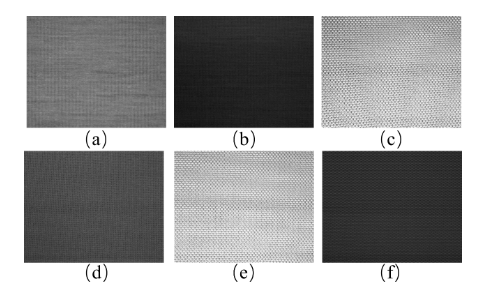

# Time-Series Circula Knitting Dataset  
First Edition of the Circula Knitting Dataset  
— Intelligent Systems Software Laboratory, National Central University, Taiwan

## Introduction to the First Edition of the Circula Knitting Dataset
The first edition of the Circula Knitting Dataset has been compiled and open-sourced by the Intelligent Software Systems Laboratory at National Central University, Taiwan. It includes three types of knitted fabrics. The dataset consists of 90 training images and 15597 test images, with image resolutions of 800x640 and 400x320.

## Dataset Characteristics

### Cutline Characteristics
To facilitate precise cutting after production, circular knitting machines incorporate two missing needles at fixed positions to form cutlines. These cutlines are an intentional part of the design, serving as guidelines for fabric cutting rather than defects. However, these cutlines closely resemble common defects, such as vertical line defects (V-line). Therefore, distinguishing cutlines from actual defects is a critical challenge in real-time defect detection.

  
Defect-free sample image

### Illumination Characteristics
Since the camera lacks a color sensor, the captured images are strongly affected by lighting conditions. As the camera can only capture grayscale information, the same fabric may appear in different shades under varying lighting conditions. Hence, accurately distinguishing between normal and defective images across different lighting levels is another key challenge in real-time defect detection.

<p align="center">
  
</p>

Examples of fabric images under varying illumination conditions:  
(a) dataset-1 with gray levels ranging from 102 to 117;  
(b) dataset-2, 70–79;  
(c) dataset-3, 36–46;  
(d) dataset-4, 69-78;  
(e) dataset-5, 152–194;  
(f) dataset-6, 155–203.

### Periodicity Characteristics
The periodicity of images in different datasets may vary. Periodicity refers to the number of images between the occurrences of two consecutive cutlines. In the Circula Knitting Dataset, this value ranges from 130 to 500.

For example, periodicity = 60:  


### Defect Characteristics
The dataset includes a wide range of defect types, including common defects such as linear defects, point defects, and medium-sized holes. Additionally, it contains rare large-scale defects and defects that appear alongside cutlines in the same image.

<p align="center">
  
</p>

Defect sample image

## Dataset Structure
The dataset includes three different knitted fabric textures, labeled as Texture 1, Texture 2, and Texture 3. These textures are further divided based on lighting conditions, resulting in six datasets:


## Training and Testing Data Splits
Each texture has one training dataset and several testing datasets.

The test images are collected sequentially to reflect the dynamic nature of real-world industrial processes. The table below provides detailed information of each texture:

| Dataset  | Illumination Type    | Texture   | Train-Normal | Train-Cutline | Train-Gray Range | Test-Normal | Test-Cutline | Test-Defect | Test-Gray Range |
|----------|----------------------|-----------|--------------|----------------|------------------|-------------|---------------|--------------|------------------|
| Dataset1 | Uniform illumination | Texture-1 | 15           | 15             | 102–117          | 4259        | 313           | 51           | 102–117          |
| Dataset2 |                      | Texture-2 | 15           | 15             | 70–79            | 1702        | 81            | 23           | 70–79            |
| Dataset3 |                      | Texture-3 | 15           | 15             | 36–46            | 4080        | 191           | 19           | 36–46            |
| Dataset4 | Uneven illumination  | Texture-1 | 15           | 15             | 102–117          | 991         | 68            | 121          | 69–78            |
| Dataset5 |                      | Texture-2 | 15           | 15             | 70–79            | 1706        | 102           | 22           | 152–94           |
| Dataset6 |                      | Texture-3 | 15           | 15             | 36–46            | 1777        | 78            | 13           | 155–203          |

## File Structure
The Circula Knitting Dataset (CKD) folder contains three fabric types: Texture 1, Texture 2, and Texture 3. These are placed in three separate directories. The overall structure is as follows:

```
Circular_Knitting_Dataset/
├── texture1/
├── texture2/
└── texture3/
```

Each knitted fabric dataset includes three subdirectories: train (training dataset), test (testing dataset), and groundtruth. The training set contains defect-free images and periodic cutline images. The test set consists of defect-free images, periodic cutline images, and defective samples. Corresponding ground truth defect masks are stored in the groundtruth folder.

For example, the file structure of Texture 1 is shown below:

```
Circular_Knitting_Dataset/
├── texture1/
│   ├── train/
│   │   ├── defect-free/
│   │   ├── cutline/
│   │   └── groundtruth/       # cutline's mask
│   └── test/
│       ├── illumination_1/
│       └── illumination_2/
│           ├── data/
│           └── groundtruth/
│               ├── cutline/    # cutline mask
│               └── defect/     # defect mask
```

## Download

To be announced.

## 📄 中文版 README

For the Chinese version of this README, please refer to:

➡️ [點擊此處查看中文版 README](./README_zh.md)
