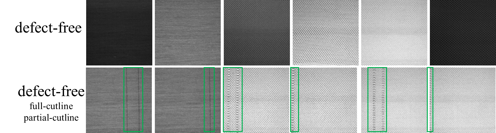
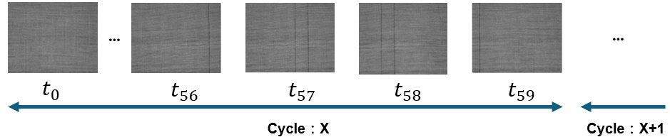
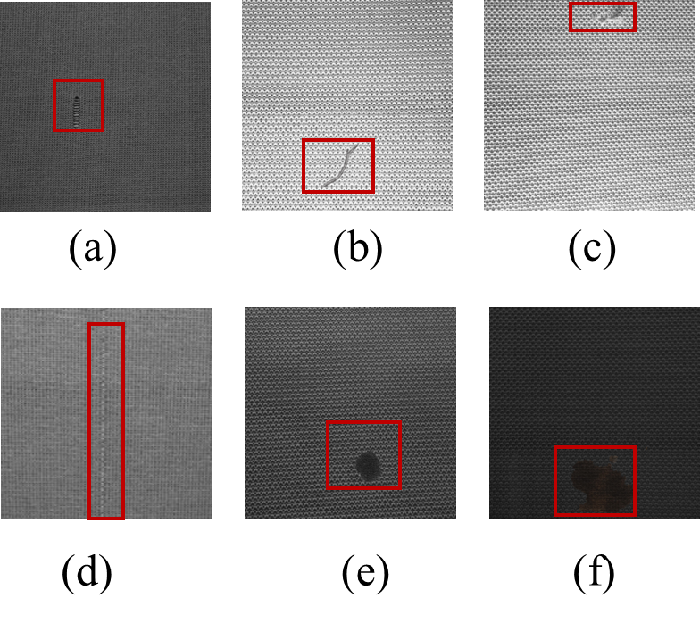
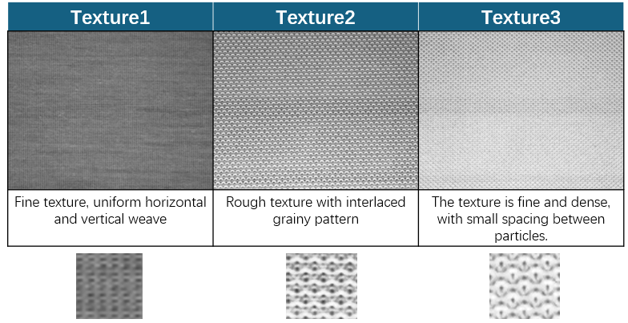

# 🧵 圓緯編影像時間序列資料集  
第一版 Circula Knitting Dataset  
— 國立中央大學智慧系統軟體實驗室

## 📌 資料集簡介  
Circula Knitting Dataset 第一版由**國立中央大學智慧系統軟體實驗室**建立並開源，涵蓋三種類型的圓緯編織布。資料集包含 **90 張訓練影像**與 **15597 張測試影像**，影像解析度為 800x640 與 400x320。

## 📊 資料集特性

### ✂️ Cutline 特性  
為了便於產後精準裁剪，圓緯編機會在固定位置設置兩根缺針以形成裁切線（cutline）。這些 cutline 是設計中刻意製造的，作為布料裁切的參考線，並非缺陷。然而，這些 cutline 外觀上與常見的垂直線缺陷（如 V-line）極為相似，因此在即時缺陷檢測中，**準確區分 cutline 與真實缺陷是一大挑戰**。

  
**無瑕疵樣本影像**

### 💡 光照特性  
由於相機不具備彩色感測元件，因此所拍攝影像**強烈受光照影響**。攝影機僅能擷取灰階資訊，同一塊布在不同光照下會呈現不同明暗程度。這使得在不同光照條件下準確區分正常與異常樣本成為另一大挑戰。

<p align="center">
  
</p>

**不同光照條件下的布料樣本**：  
(a) Dataset-1：灰階值介於 102–117；  
(b) Dataset-2：70–79；  
(c) Dataset-3：36–46；  
(d) Dataset-4：69–78；  
(e) Dataset-5：152–194；  
(f) Dataset-6：155–203。

### ⏱ 週期性特性  
資料集內不同布料的影像具有不同的週期性。所謂週期性，是指兩個相鄰 cutline 之間所間隔的影像數量。此值在本資料集中介於 **130 到 500 張** 之間。

例如，當週期性 = 60 時：



### 🔧 缺陷特性  
資料集涵蓋多種缺陷類型，包含：

- 常見的線狀缺陷、點狀缺陷與中型破洞
- 稀有的大型缺陷
- 與 cutline 同時出現在同一張影像中的缺陷

<p align="center">
  
</p>

**缺陷樣本影像**

## 📁 資料夾結構  
資料集包含三種不同針織紋理，分別為 Texture 1、Texture 2、Texture 3。這些紋理又依照不同光照條件進一步分為六組子資料集：



## 🔍 訓練與測試資料分配  
每個紋理包含一組訓練資料集與數組測試資料集。

測試資料以**連續方式收集**，模擬實際工廠生產過程中的連續動態情境。以下表格列出每組資料集的詳細資訊：

| 資料集   | 光照條件             | 紋理類型   | 訓練-正常 | 訓練-cutline | 訓練灰階範圍 | 測試-正常 | 測試-cutline | 測試-缺陷 | 測試灰階範圍 |
|----------|----------------------|------------|-----------|---------------|----------------|------------|----------------|-------------|----------------|
| Dataset1 | 均勻光照             | Texture-1  | 15        | 15            | 102–117         | 4259       | 313             | 51          | 102–117         |
| Dataset2 |                      | Texture-2  | 15        | 15            | 70–79           | 1702       | 81              | 23          | 70–79           |
| Dataset3 |                      | Texture-3  | 15        | 15            | 36–46           | 4080       | 191             | 19          | 36–46           |
| Dataset4 | 不均勻光照           | Texture-1  | 15        | 15            | 102–117         | 991        | 68              | 121         | 69–78           |
| Dataset5 |                      | Texture-2  | 15        | 15            | 70–79           | 1706       | 102             | 22          | 152–94          |
| Dataset6 |                      | Texture-3  | 15        | 15            | 36–46           | 1777       | 78              | 13          | 155–203         |

## 📂 檔案結構  
資料夾中包含三種不同布料，分別為 texture1、texture2 與 texture3，目錄結構如下：

```
Circular_Knitting_Dataset/
├── texture1/
├── texture2/
└── texture3/
```

每個布料資料夾都包含三個子目錄：`train`（訓練集）、`test`（測試集）、`groundtruth`（標註）。訓練集含有 defect-free 與 cutline 影像；測試集含有 defect-free、cutline 與 defect 影像，對應的 mask 放在 groundtruth 中。

以 Texture 1 為例：

```
Circular_Knitting_Dataset/
├── texture1/
│   ├── train/
│   │   ├── defect-free/
│   │   ├── cutline/
│   │   └── groundtruth/       # cutline 對應的 mask
│   └── test/
│       ├── illumination_1/
│       └── illumination_2/
│           ├── data/
│           └── groundtruth/
│               ├── cutline/    # cutline mask
│               └── defect/     # defect mask
```

## 🔽 下載方式

[Dataset link.](https://drive.google.com/file/d/1LR1H2EsWatYOhfT5_HHVP5PDDRn039bM/view?usp=drive_link)


## 📄 English README  
查看英文版本說明文件，請參考：

➡️ [Click here to view the English version README](./README.md)
